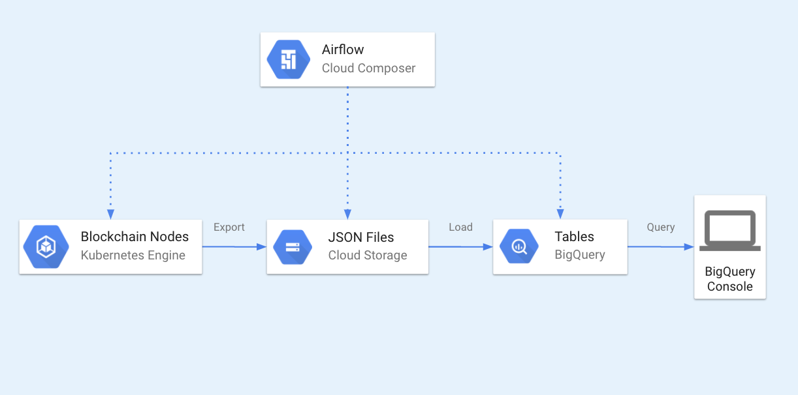

# Zilliqa ETL

## Overview

Zilliqa ETL allows you to setup an ETL pipeline in Google Cloud Platform for ingesting Zilliqa blockchain data 
into BigQuery. It comes with [CLI tools](/cli) for exporting Zilliqa data into JSON newline-delimited files
partitioned by day. 

Data is available for you to query right away in 
[Google BigQuery](https://console.cloud.google.com/bigquery?page=dataset&d=crypto_zilliqa&p=public-data-finance).

## Architecture

[Google Slides version](https://docs.google.com/presentation/d/16h_JVok0dZmHQfnWeGAUJAsEzkwUh2DSHVdhTe5LC-E/edit?usp=sharing)

1. [Airflow DAGs](https://airflow.apache.org/) export and load Zilliqa data to BigQuery daily. 
    Refer to [Zilliqa ETL Airflow](/airflow) for deployment instructions.
